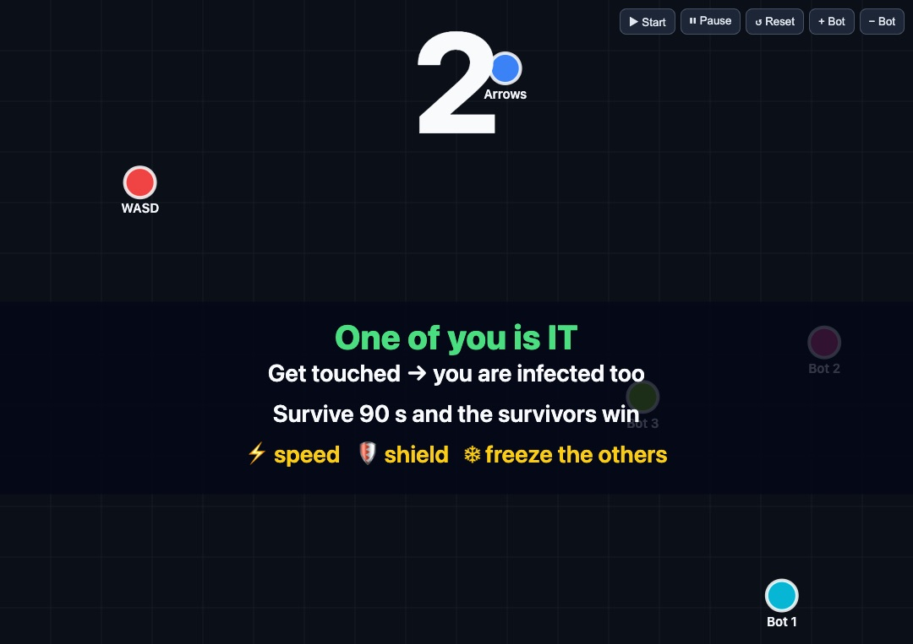
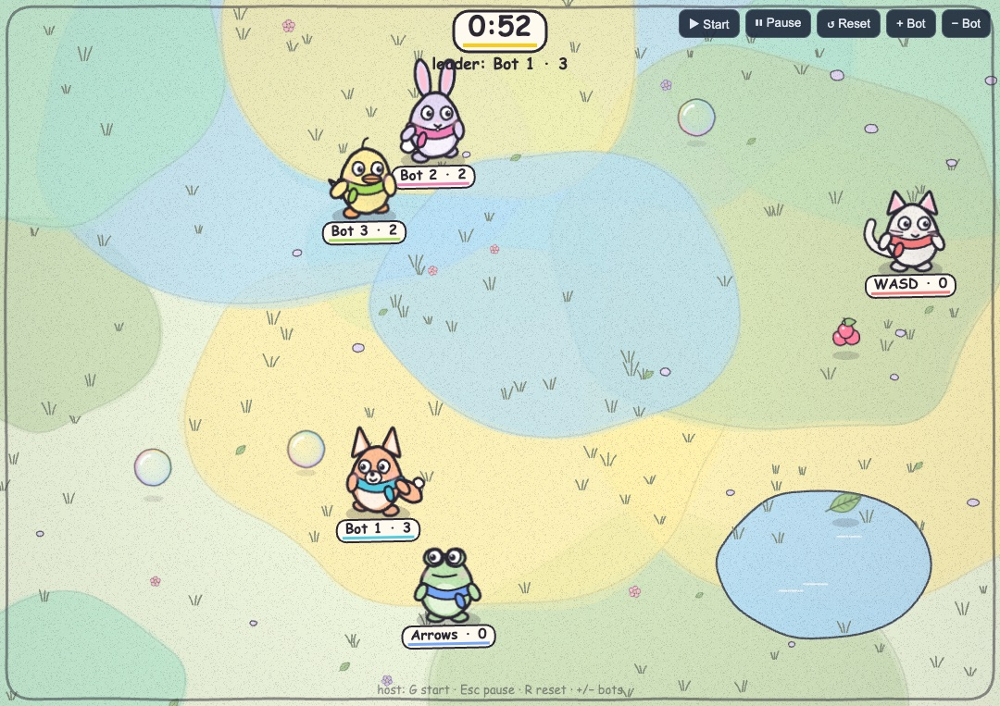
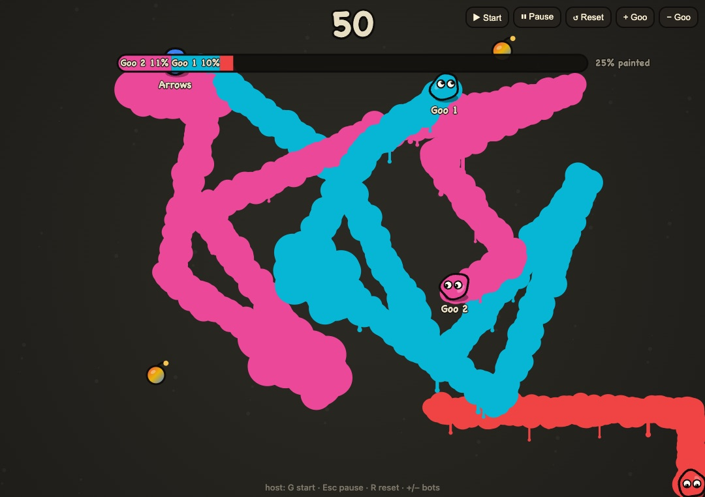

# Bubble-Catch

**Party games you play on a big screen, using your phone as the controller.**

> Built in a **2-hour build session** at the
> [Stockholm | Fable 5.1 x Opus 5.5 Build Day](https://luma.com/claude-kh4r) (Claude Community,
> Epicenter Stockholm, 25 September 2026). See [the team](#the-team) below.

- **Big screen (laptop or TV):** shows the game world, with every player on it.
- **Phones:** each one becomes a controller with a joystick and two buttons, **A** and **B**.
- **To join:** scan the QR code on the big screen or type the 4-letter code. No app to install.

## The games

Four games, same phones. Every game has a ready-up lobby, a countdown, a timed round and a results
screen, plus host buttons (Start, Pause, Reset, add/remove test bots) in the top-right corner.

| Game | How you win | Open it with |
|---|---|---|
| **Tag / Infection** (default) | One player is IT and infects everyone they touch. Survive 90 seconds. | `/host/` |
| **Meadow** | Be a hand-drawn animal and collect the most bubbles, leaves, berries and flowers in 60 seconds. | `/host/?game=meadow` |
| **Paint to Conquer** | Be a goo blob that paints the floor. Own the most floor when time runs out. | `/host/?game=paint` |
| **Dots** | No winner: the tiny demo game that proves phones → screen works. | `/host/?game=dots` |

| Tag | Meadow | Paint to Conquer |
|---|---|---|
|  |  |  |

Full guides: [Tag](apps/host/src/games/tag/README.md) ·
[Meadow](apps/host/src/games/meadow/README.md) ·
[Paint to Conquer](apps/host/src/games/paint/README.md)

## How to play Tag (the default game)

1. **Get ready.** Everyone runs around. Press **A** when you're ready. The game starts when everyone
   is ready (at least 2 players).
2. **5… 4… 3… 2… 1…** Everyone is placed at a random spot while the rules show on screen.
3. **One player becomes IT** and turns green.
4. **IT chases everyone.** Anyone IT touches gets infected, turns green too, and starts chasing the
   others. The green team keeps growing.
5. **The round lasts 90 seconds:**
   - At least one player still clean at the end: **the survivors win.**
   - Everyone caught before then: **the infected win.**
6. **Results** show who lasted longest, then everyone goes back to the ready-up screen.

## Tag tricks

- **B = dash.** A quick burst of speed to escape or catch someone. You can use it again after 2.5 seconds.
- **Power-ups** appear on the floor. Run over one to grab it:
  - ⚡ **Speed:** faster for 4 seconds.
  - 🛡 **Shield:** blocks one tag.
  - ❄ **Freeze:** freezes the other team for 2 seconds.

## Run it

```bash
npm install
npm run build && npm start     # open http://<your-ip>:8787/host/ on the big screen
npm run tunnel                 # optional: ngrok link so phones on mobile data can join
```

Players on the same Wi-Fi scan the QR code on the big screen. Open the host page with your
machine's network IP, not `localhost`, so the QR code works on phones.

## Play over the internet (ngrok)

Use this when players aren't on your Wi-Fi (phones on mobile data, or a network that blocks
devices from talking to each other). ngrok gives your machine a public `https://` link.

### One-time setup: your own ngrok account

1. **Install ngrok:** `brew install ngrok` on macOS, or download it from https://ngrok.com/download.
2. **Sign up** at https://dashboard.ngrok.com/signup (the free plan is enough).
3. **Verify your email.** Check your inbox, or resend the verification email from
   https://dashboard.ngrok.com/user/settings. Until you do, ngrok refuses to start with
   `ERR_NGROK_123`.
4. **Connect ngrok to your account.** Copy your authtoken from
   https://dashboard.ngrok.com/get-started/your-authtoken and run:
   ```bash
   ngrok config add-authtoken <your-token>
   ```
   This saves the token in ngrok's own config file on your machine, not in this repo. Never commit
   or share your token. If it leaks, reset it in the dashboard and run the command again.

Check it with `ngrok config check`.

### Start a game

```bash
npm run build && npm start     # terminal 1: game server on port 8787
npm run tunnel                 # terminal 2: prints https://<something>.ngrok-free.app (or .dev)
```

- **Big screen:** open `https://<your-ngrok-url>/host/`. The QR code points at the tunnel automatically.
- **Players:** scan the QR code, or open `https://<your-ngrok-url>/` and type the join code.
- **Browser warning:** the free plan shows a one-time "You are about to visit…" page on each
  device. Tap **Visit Site**.

### Good to know

- **Your link can change.** On some free accounts the link is different every time you restart
  `npm run tunnel`. To keep the same link, use the free static domain listed at
  https://dashboard.ngrok.com/domains:
  `ngrok http 8787 --domain=<your-domain>` (newer ngrok versions call this flag `--url`).
- **QR still shows an old link?** Open the host once with
  `?controller=https://<your-ngrok-url>/` added to the URL. The big screen remembers it.
- **While developing** (`npm run dev`), use `npm run tunnel:dev` instead. It tunnels the phone app on
  port 5174. Then open the host at `http://localhost:5173/?controller=https://<your-ngrok-url>/`.
- **To stop:** press `Ctrl+C` in the tunnel terminal. Anyone with the link can reach your game
  while the tunnel is running, but only the game, nothing else on your machine.

## Behind the scenes

- **The phones only send your moves.**
- **The big screen runs the whole game.**
- **A small server in between just passes messages along.**

That's why anyone can join from a web browser, and why you can swap in a different game without
changing the phone side.

## More

- Game guides: [Tag](apps/host/src/games/tag/README.md) ·
  [Meadow](apps/host/src/games/meadow/README.md) ·
  [Paint to Conquer](apps/host/src/games/paint/README.md)
- Write your own game: [docs/GAME_MODULE.md](docs/GAME_MODULE.md)
- Developer orientation, run options and the rules: [CLAUDE.md](CLAUDE.md). Docs live in [docs/](docs).

## Built at Stockholm | Fable 5.1 x Opus 5.5 Build Day 🏗️

Two hours. Five people. One laptop plugged into a big screen. A lot of snacks. 🍕

This whole thing came out of a **2-hour build session** at the
[Stockholm | Fable 5.1 x Opus 5.5 Build Day](https://luma.com/claude-kh4r), a hands-on evening
hosted by Claude Community Events at Epicenter Stockholm on Friday 25 September 2026. We went from
an empty repo to a working party-game platform with four games, and then pitched it on stage.
Nobody's phone was harmed. Probably.

<a id="the-team"></a>

### The team (a.k.a. the Party Crew 🎉)

**🏛️ Måns Hellgren, The Architect**\
[LinkedIn](https://www.linkedin.com/in/hellgrenmns/) · [GitHub](https://github.com/mnshellgren)\
Built the architecture and the main game engine before most of us had found the Wi-Fi password.
Got the scaffolding in place so everything *just worked* from minute one. Suspiciously calm the
whole time.

**🎨 Barbora Gustafsson, The Visual Wizard**\
[LinkedIn](https://www.linkedin.com/in/barbora-gustafsson/) · [GitHub](https://github.com/Baragustay)\
Brought the magic. Dreamed up the `@party/world` art package and the Meadow game, and drew the
cat, the frog, the fox, the bunny, the duck, the pig, the penguin and the bear. Every animal in this
game exists because of Barbora. 🐸🦊🐰

**🧭 Viyan Portnoff, The Compass**\
[LinkedIn](https://www.linkedin.com/in/starblazingunicorn/) · [GitHub](https://github.com/viyanateaa)\
Kept pointing us in the right direction when we were about to build a fifth game instead of
finishing the first four. Great ideas, great listener, and a steady supply of good vibes. ✨

**🎤 Megha Sainath, The Stage Star (and Time Police 🚨)**\
[LinkedIn](https://www.linkedin.com/in/megha-sainath/) · [GitHub](https://github.com/meghasainath)\
Walked on stage in front of 100 people with about two minutes of prep and pitched like she'd
rehearsed for weeks. Also our excellent time police: "Five minutes left!" has never sounded so
motivating. We finished on time because of her. ⏱️

**🚗 Christopher State, The Driver**\
[LinkedIn](https://www.linkedin.com/in/state/) · [GitHub](https://github.com/statecs)\
Behind the wheel on Git, merging everyone's work without a single tear shed (in public). Turned
a laptop into the game host and got ngrok running so the whole room could join from their phones.
Kept the mood positive and the scope realistic. "Yes, and... maybe after the demo." 🛞

### Thank you to the hosts 💛

A huge thank you to **Tom Axberg**, **Somesh Kesarla Suresh**, **Matilda Muhr Göransson** and
**Vera Litens** for hosting the evening. Thanks also to
[Claude Community Events](https://claude.com/community) and the Stockholm Claude Community for
putting it together, and to **Epicenter Stockholm** for the venue. Thank you for the food, the
drinks, the help when we got stuck, and a great evening of building! 🙌
